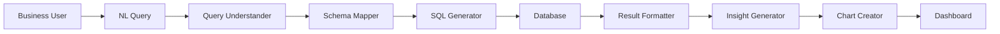

# Data Democratization Toolkit

Empowering business users with self-service analytics — NL queries, automated insights, no SQL required.

## Features

- **Natural Language Queries**: Ask questions in plain English
- **Auto Insights**: Automatically discover patterns and trends
- **Smart Charts**: Recommend visualizations for your data
- **Enterprise Connectors**: Microsoft Fabric, Power BI, SQL databases
- **Safety First**: Read-only queries with injection prevention

## Architecture



## Quick Start

```python
from src.query.nl_to_sql import NLToSQL
from src.insights.auto_insight_generator import AutoInsightGenerator

nl_engine = NLToSQL(database_url="postgresql://...")
results = nl_engine.query("What was our revenue last quarter?")

insight_gen = AutoInsightGenerator()
insights = insight_gen.analyze(results)
```

## Dependencies

- langchain >= 0.1.0
- openai >= 0.27.0
- sqlalchemy >= 2.0.0
- plotly >= 5.0.0
- pandas >= 1.3.0
- pyodbc >= 4.0.0

## License

MIT License - see LICENSE file for details
